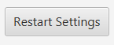

## Table of contents
* [General info](#general-info)
* [Technologies](#technologies)
* [Setup](#setup)
* [Features](#features)
* [Basci overview](#basic-overview)

## General info
The Elevator System app is designed to simulate a building elevator control system. The above project presents the application server layer. You can find the client layer here: https://github.com/Maciej-Wilczyk/elevator-system-server

## Technologies
Project is created with:
* Java 11
* JavaFX
* Spring-Boot
* Maven

## Setup
You need Java 11 (minimum) installed to run the application. Clone this repo to your desktop.
You must turn on the elevator-system-server before starting this application. You can find it here: https://github.com/Maciej-Wilczyk/elevator-system-server
The easiest way to start the application with Maven (you must have it installed on your computer)
In the console go to the project folder and run the command:   mvn javafx:run
## Features
* GUI implementation:
* comunication with server

## Basic overview
Application window
Click it to make a simulation step    Select the target floor (buttons panel inside elevator)  Call for an elevator to a requested floor and indicate in which direction you want to go!  Confirm data from select "Select floor", "Pickup floor", "Pickup Button"  Restart configuration - set number of floors and elevators    Select the operating mode step by step - need to click step button to make a step real time - the system works in its own time  Green color shows that the target floor has been reached  Do you want to save data?  

